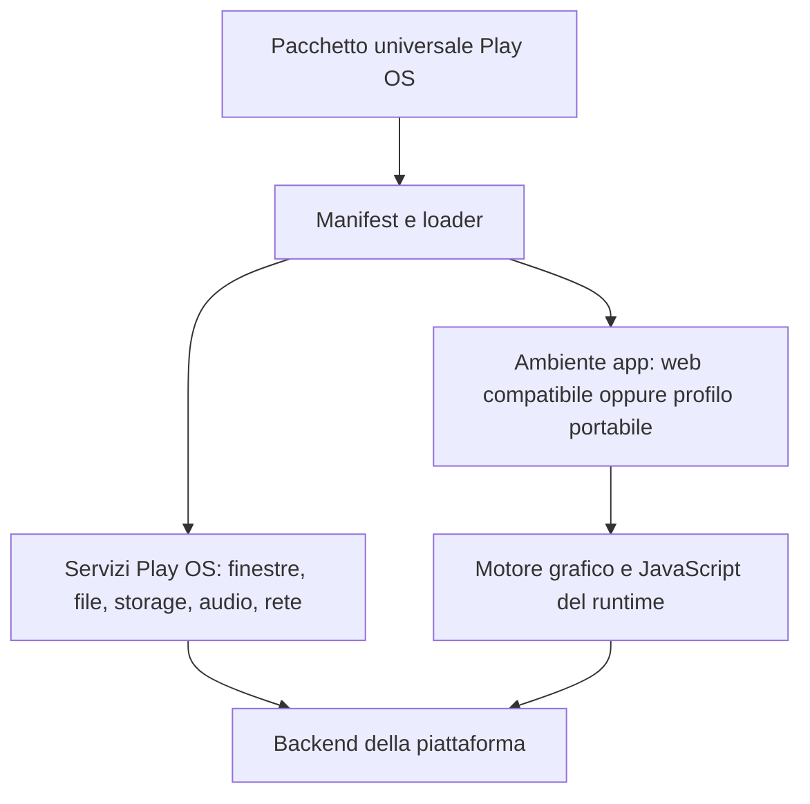

# Analisi delle app e del runtime Play OS

Ricerca del 2 ottobre 2026. Obiettivo: un desktop virtuale locale, con taskbar e finestre, che esegua app dentro Play OS; un unico pacchetto per app, senza build per console; riuso di molte app desktop disponibili sul web. PSP, Vita, Linux, Windows e macOS sono i primi target; PS3/PS4 sono target futuri da verificare.

## Risultato principale

Per massimizzare il riuso delle app esistenti, la compatibilità con la piattaforma web conta più del framework UI scelto. React, Vue, jQuery e JavaScript senza framework convergono sul DOM, CSS, eventi, input e API del browser. La sola esecuzione JavaScript non fornisce questi servizi. PocketJS resta interessante per un runtime leggero sulle console, ma non è un sostituto compatibile di un browser.

Il campione include 16 app/componenti con interfaccia e 4 librerie riutilizzabili, più framework di gioco e desktop web di riferimento. Non è un censimento dell'intero web e non permette una classifica di diffusione con percentuali. README e manifest sono stati letti insieme a sorgenti selezionati; non tutti i repository sono stati sottoposti ad audit integrale. Nessun progetto è stato eseguito su PSP/Vita per questa ricerca. Le difficoltà indicate sono valutazioni tecniche, non benchmark né preventivi.

## Catalogo

| Progetto | Tipo | Tecnologie/requisiti | Port al runtime leggero |
|---|---|---|---|
| [Webamp](https://github.com/captbaritone/webamp) | Lettore musicale (app) | React DOM, CSS, Web Audio; MilkDrop opzionale WebGL | Alto: vista e backend audio |
| [JS Paint](https://github.com/1j01/jspaint) | Disegno (app) | HTML/CSS, DOM, jQuery, Canvas 2D | Alto: DOM e Canvas |
| [Quill](https://github.com/slab/quill) | Testo formattato (componente) | TypeScript, DOM, contenteditable, selezione e layout del browser | Alto: editing e layout |
| [Slate](https://github.com/ianstormtaylor/slate) | Editor di documenti (framework) | Core JS/TS; integrazione slate-react basata su React e DOM | Alto per vista; core da valutare |
| [Univer](https://github.com/dream-num/univer) | Fogli di calcolo e documenti (SDK) | TypeScript, Canvas, UI web, motore formule; API browser/Node | Molto alto per applicazione completa |
| [Jspreadsheet CE](https://github.com/jspreadsheet/ce) | Foglio di calcolo (componente) | JavaScript, DOM/CSS, jSuites, modulo formule | Alto: interfaccia a celle |
| [x-spreadsheet](https://github.com/myliang/x-spreadsheet) | Foglio di calcolo (componente) | JavaScript, DOM/CSS, rendering Canvas | Alto: rendering e editing |
| [ONLYOFFICE Docs](https://github.com/ONLYOFFICE/DocumentServer) | Suite Office (suite client/server) | Frontend web e SDK JS; backend e conversione formati | Molto alto; include servizi non JS |
| [CodeMirror](https://github.com/codemirror/dev) | Editor testo/codice (componente) | JavaScript/TypeScript, DOM, CSS, editing testo del browser | Alto: layout, input e selezione |
| [PDF.js](https://github.com/mozilla/pdf.js) | Lettore PDF (libreria + viewer) | JavaScript, HTML5, Canvas; worker e altri requisiti dipendono dalla build | Alto: renderer e gestione memoria |
| [Excalidraw](https://github.com/excalidraw/excalidraw) | Lavagna e diagrammi (app + componente) | React/TypeScript, DOM e Canvas | Alto |
| [js-solitaire](https://github.com/rjanjic/js-solitaire) | Solitario (gioco) | JavaScript, DOM, SCSS, sprite, mouse e requestAnimationFrame | Medio: riscrittura rendering/input |
| [Minesweeper](https://github.com/ziebelje/minesweeper) | Campo minato (gioco) | Asset CSS/immagini/JavaScript web nel repository | Basso/medio come stima; audit sorgente da completare |
| [JavaScript Tetris](https://github.com/jakesgordon/javascript-tetris) | Tetris (gioco) | JavaScript, Canvas 2D, DOM minimo, tastiera e frame loop | Basso/medio: subset grafico e input |
| [c4](https://github.com/kenrick95/c4) | Forza quattro (gioco) | JavaScript/TypeScript e Canvas | Basso/medio come stima |
| [mcalculator](https://github.com/muzam1l/mcalculator) | Calcolatrice Microsoft sul web (app con core WASM) | Core C++ portato con WebAssembly, frontend web | Alto senza runtime WASM |
| [mathjs](https://github.com/josdejong/mathjs) | Calcoli e formule (libreria) | JavaScript, parser e funzioni matematiche | Da verificare su QuickJS; UI da creare |
| [chess.js](https://github.com/jhlywa/chess.js) | Regole degli scacchi (libreria) | TypeScript/JavaScript senza interfaccia grafica | Da verificare su QuickJS; UI da creare |
| [HyperFormula](https://github.com/handsontable/hyperformula) | Motore formule per fogli (libreria) | TypeScript headless, browser e Node | Da verificare su QuickJS; UI da creare |
| [SheetJS](https://github.com/SheetJS/sheetjs) | Lettura/scrittura fogli (libreria) | JavaScript, parsing e scrittura formati; non interfaccia Excel | Da verificare su QuickJS e con file limitati |

Il catalogo include componenti perché molte applicazioni richieste si costruiscono componendo un editor esistente e una piccola integrazione con il desktop. Quill non è Word, Jspreadsheet non garantisce tutta la compatibilità Excel, SheetJS non è un editor e chess.js non fornisce un avversario AI. Un'interfaccia simile a Office e l'apertura fedele di DOCX/XLSX sono requisiti diversi.

## Cosa usano le app

**DOM e CSS.** Il gruppo comprende Webamp, Quill, Slate React, Jspreadsheet, CodeMirror e il solitario esaminato. Servono creazione/rimozione di elementi, stili, eventi, coordinate e spesso misurazione del layout. Il solitario usa document.getElementById, appendChild, classList, getBoundingClientRect e requestAnimationFrame nel [sorgente](https://github.com/rjanjic/js-solitaire/blob/master/src/index.js). Questi sono requisiti del browser, non di un particolare framework.

**Canvas 2D insieme a UI DOM.** Paint, Tetris, Univer, Excalidraw e altri disegnano superfici grafiche, ma Canvas non elimina la necessità di menu, campi di testo e input. Il [Tetris esaminato](https://github.com/jakesgordon/javascript-tetris/blob/master/index.html) usa Canvas 2D e un piccolo insieme DOM: è un candidato migliore per una prima implementazione di compatibilità di un editor Office. [Univer](https://github.com/dream-num/univer) separa motore formule, rendering Canvas e UI in plugin: la modularità aiuta, ma non dimostra l'esecuzione su QuickJS o PSP.

**Audio del browser.** Webamp usa AudioContext, nodi gain, filtri, analizzatore e una sorgente basata sul supporto multimediale del browser. Il [contratto IMedia](https://github.com/captbaritone/webamp/blob/master/packages/webamp/js/media/index.ts) consente di valutare un backend alternativo. Riproduzione PCM non equivale a decoding MP3, ricerca nel brano, equalizzatore e analisi FFT: ciascuna funzione deve esistere nel runtime. MilkDrop/Butterchurn aggiunge WebGL e va trattato come funzione separata.

**WebGL/WebGPU e WebAssembly.** [Phaser](https://github.com/phaserjs/phaser) dichiara Canvas/WebGL per giochi HTML5, ma la compatibilità dipende dalla versione e dai renderer effettivamente disponibili. [PixiJS](https://github.com/pixijs/pixijs) non va assunto come libreria Canvas 2D minima: la grafica GPU è un requisito da verificare. La [calcolatrice mcalculator](https://github.com/muzam1l/mcalculator) porta un core C++ in WebAssembly. Un file WASM può essere distribuito senza build per ogni CPU, ma il runtime deve implementare WASM e tutte le importazioni richieste; QuickJS da solo non garantisce questo supporto.

**Librerie senza interfaccia.** mathjs, chess.js, HyperFormula e parti di SheetJS permettono di riutilizzare logica e algoritmi anche creando una vista diversa. Le dipendenze, il target ECMAScript e le API di ambiente vanno comunque verificati: una libreria che supporta Node non è automaticamente eseguibile su QuickJS. È la strada più concreta per calcolatrice, scacchi e un piccolo foglio portabile.

## Desktop web che mostrano il modello

[daedalOS](https://github.com/DustinBrett/daedalOS) integra già Webamp, editor, PDF, Paint e giochi in finestre e taskbar. Il suo [manifest](https://github.com/DustinBrett/daedalOS/blob/main/package.json) mostra React, Next.js, BrowserFS, IndexedDB, componenti di editing e librerie WASM. È una prova del modello di integrazione sul web e un riferimento per gli adapter delle app. Non dimostra il funzionamento su console e non conviene copiarne tutte le dipendenze per partire su PSP.

[OS.js](https://github.com/os-js/OS.js) offre API applicative, gestione finestre, toolkit GUI e filesystem astratto. È utile per progettare il contratto Play OS. Il template include servizi server e un ambiente web: non è un runtime console già portato. Vanno distinti tooling di sviluppo, frontend e servizi richiesti durante l'esecuzione.

[98.js](https://github.com/1j01/98) integra calcolatrice, blocco note, Paint, solitario, campo minato e Webamp. È un riferimento visivo e funzionale. Il repository principale dichiara di essere source-available e non ancora con licenza open source; non va assunto come base liberamente redistribuibile. I progetti inclusi hanno condizioni proprie da verificare.

## Valutazione dei runtime

| Runtime | Vantaggio | Limite per questo progetto |
|---|---|---|
| [PocketJS](https://github.com/pocket-nexus/pocketjs) | UI leggera e host PSP/Vita esistenti | Nessun DOM/CSS engine/WebView; port delle viste web necessario |
| [QuickJS](https://bellard.org/quickjs/) | Motore JavaScript piccolo, incorporabile | Non implementa il browser; è solo una parte del runtime |
| [CEF/Chromium](https://chromiumembedded.github.io/cef/general_usage) | Ampia compatibilità web e rendering incorporato/offscreen sui PC | Runtime desktop complesso; multiprocesso; nessun port homebrew console verificato qui |
| [Tauri con WebView](https://v2.tauri.app/reference/webview-versions/) | Host PC che usa motori web del sistema | Motori/versioni diversi; non crea una WebView moderna su PSP/Vita/PS3 |
| [Ultralight](https://ultralig.ht/) | WebKit incorporabile, texture, API C/C++; dichiara PC e PS4/PS5 | PSP/Vita/PS3 non dichiarate; disponibilità homebrew non verificata; sorgenti completi proprietari; limiti multimediali |
| [Servo](https://github.com/servo/servo) | Motore web incorporabile con sorgenti disponibili | Port console non verificato; dipendenze e copertura API da misurare sulle app |
| [NetSurf](https://www.netsurf-browser.org/documentation/info) | Browser concepito anche per sistemi limitati | La documentazione dichiara JavaScript incompleto e disabilitato per default; non è soluzione pronta per le app del campione |
| [litehtml](https://github.com/litehtml/litehtml) | Layout HTML/CSS leggero e callback di disegno | Non è un browser completo; DOM dinamico, JS, editing, Canvas e audio restano da integrare |

Ultralight dichiara supporto PS4 sul sito ufficiale. Questo non equivale alla disponibilità di un SDK per homebrew. Il sito indica anche WebGL e WebRTC tra le eccezioni e video/audio HTML5 sperimentali; il supporto alle funzioni audio di Webamp deve essere verificato a parte. Non basta che il motore mostri una pagina React. Le condizioni commerciali e l'accesso ai port console devono essere confermati prima di sceglierlo.

Sommare QuickJS e litehtml è una possibile base sperimentale per un sottoinsieme web. Non produce automaticamente una compatibilità browser: il collegamento tra oggetti DOM e layout, invalidazione, eventi, campi editabili, selezioni e servizi rimane lavoro del progetto. Usare un DOM fittizio in JavaScript non fornisce di per sé pixel, layout o un editor di testo.

## Architettura proposta

Play OS controlla desktop, finestre, installazioni e taskbar. Le app chiedono servizi tramite API piccole e versionate. Il runtime web deve implementare le API browser usate dalle app: introdurre solo playos.window non risolve la loro compatibilità. Il backend di sistema gestisce filesystem, audio, rete e input, senza diffondere condizioni PSP/PC dentro la logica delle app.

Per conservare il pacchetto unico, distribuire JavaScript testuale/bundle e risorse portabili. TypeScript e bundling si elaborano una volta in fase di pubblicazione. Il motore può trasformare internamente il JS quando lo carica: l'utente e lo sviluppatore non producono build distinte per console. Evitare di basare il formato pubblico su bytecode QuickJS: la [documentazione](https://bellard.org/quickjs/quickjs.html) lo lega alla versione del motore; la portabilità tra architetture non va presunta. Anche atlanti, texture e font in formato nativo di un host possono compromettere la promessa del pacchetto unico: il runtime deve convertirli o consumare un formato comune.

Le app devono vivere in contesti separati dentro il runtime, con accesso ai servizi mediato, limiti e lifecycle. Non è necessario un programma esterno per app. Un motore come CEF può usare processi interni, ma finestre e taskbar restano in Play OS. Il requisito espresso è l'esecuzione dentro il desktop; non si assume automaticamente che richieda un solo processo di sistema.

Definire un profilo minimo compatibile con tutte le macchine supportate. Il manifest può elencare funzionalità opzionali e requisiti. Un pacchetto può adattare dimensioni, animazioni e visualizzazioni senza ricompilazione. Può anche contenere due viste (web e portabile), ma ciò richiede un port mantenuto: non sarebbe la stessa applicazione web inalterata e non va presentato come conversione gratuita.

## Il nodo PSP e le tre promesse

Occorre verificare separatamente: (1) stesso file di pacchetto, (2) app eseguita localmente dentro Play OS, (3) poche modifiche a molte app web esistenti. Le fonti esaminate non dimostrano un runtime che soddisfi oggi tutte e tre su tutte le console richieste. Il pacchetto unico è progettualmente possibile; la disponibilità delle API e il consumo di memoria devono essere dimostrati sul target più limitato.

Ridurre i frame al secondo aiuta il carico CPU, ma non crea DOM, Web Audio o memoria aggiuntiva. La PSP non è automaticamente esclusa: si può portare un sottoinsieme comune e convertire le app. Tuttavia un runtime browser esteso su PSP è un progetto di compatibilità, non soltanto un port dell'interfaccia del desktop. Una UI Office avanzata può fallire per memoria o API mancanti prima ancora di risultare lenta.

PS3/PS4 richiedono un inventario dell'SDK homebrew, del compilatore, delle dipendenze, dell'accesso alla GPU e ai servizi. Il supporto di un prodotto alla PS4 commerciale non dimostra quello sul percorso homebrew; la potenza del dispositivo da sola non completa il port.

## Scelta consigliata e prove decisive

Per il requisito di riuso, scegliere come riferimento un ambiente web standard e mantenere Play OS indipendente dal motore specifico. Sul PC partire con Chromium/CEF come riferimento di compatibilità, oppure una WebView per un prototipo più breve. Questo avvia la verifica del catalogo e dei pacchetti; non risolve ancora le console. PocketJS può restare il candidato per shell e app portabili sui target limitati, non il vincolo al quale riscrivere subito tutte le app.

Prima di cambiare tutto il progetto, fare quattro prove sul target PSP:

1. Eseguire una libreria JS headless, con dipendenze e input reali, e misurare heap, tempo e consumo totale del processo.
2. Eseguire un Tetris Canvas o un solitario con l'adapter minimo: annotare ogni API browser mancante, rendering, eventi e geometria.
3. Eseguire un editor con digitazione, selezione, copia/incolla, apertura e salvataggio. Un textarea semplificato non prova la compatibilità Quill/contenteditable.
4. Eseguire un lettore musicale con decoding progressivo, seek, cambio brano e riproduzione mentre una finestra è minimizzata. Collegare successivamente la vista Webamp o il suo port.

Usare gli stessi identici byte del pacchetto su PC e console, verificarne SHA-256 e registrare risultati, API mancanti, picco di memoria, input e crash. Per ogni app scegliere un documento o un brano reale e misurare apertura e interazione; non dichiarare portabile un'app sulla base del solo splash screen. Un browser su PC non è una prova per PSP.

Se le prove del profilo web falliscono, la scelta va esplicitata: convertire una selezione di app in un profilo comune leggero, oppure limitare il catalogo web esteso alle piattaforme che lo eseguono. La seconda modifica la promessa originaria, quindi richiede una decisione dell'utente. Streaming da un PC/server è un'alternativa distinta: non soddisfa l'esecuzione locale delle app e non è la raccomandazione principale.

## Ordine del catalogo iniziale

Per provare il runtime: calcolatrice basata su una libreria JS verificata, solitario/campo minato, Tetris e blocco note. Per provare l'integrazione web: Webamp, JS Paint, editor Quill e Jspreadsheet. Per verificare il salto a produttività avanzata: Univer e PDF.js. ONLYOFFICE richiede una valutazione separata dei servizi; non lo inserirei come primo pacchetto universale offline.

Lo store deve pubblicare il pacchetto, API minime, funzionamento offline o dipendenza da servizi, funzioni opzionali e piattaforme effettivamente validate. Distinguere dichiarazioni degli autori e prove dei port. Le licenze si verificano sulla versione esatta scelta: molte librerie sono permissive, HyperFormula è GPL/commerciale, ONLYOFFICE Community è AGPL, Univer ha parti OSS e Pro. Un repository pubblico non implica libertà di redistribuzione.

## Stato del progetto locale

Il desktop e il loader preparati prima della ricerca sono prototipi. Non includono un browser compatibile, non caricano ancora i pacchetti pubblici e non dimostrano il runtime universale. Questa analisi è il riferimento per rivedere l'architettura; non sono state cambiate le implementazioni durante la ricerca. Il passo tecnico successivo è la prova del runtime/app, prima della rifinitura grafica o di un backend store pubblico.
